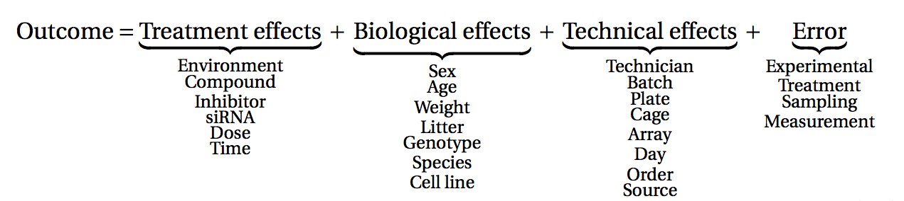

# Linear Models {#sec-lm}

**Objectives**

- Explore linear models

- Learn how to interpret coefficients


```{r load-pkg-lm, include=FALSE}
suppressPackageStartupMessages({
  library(tidyverse)
  library(patchwork)
  library(ExploreModelMatrix)
  library(SummarizedExperiment)
})
```

## Multifactorial design and linear models

The outcome of an experiment, such as a gene expression level in the case of an RNA-seq, can
be seen as the sum of several factors:

- the treatments effects (these are be the effects you actually want
  to study)
- biological effects (representing natural biological differences
  between samples that you might also have to consider)
- technical effects (that come from the experimental process itself
  and that could potentially influence the measurements)
- and lastly, outcome will also reflect an error, which represent the
  random variability (or experiment noise) that cannot be explain be
  any of the known factors.

```{r, echo=FALSE, fig.align='center', out.width='100%'}

```

(figure from [Lazic (2017)](https://www.amazon.com/Experimental-Design-Laboratory-Biologists-Reproducibility/dp/1107424887)).

## Single-factor design

Let's start by a simple design, and let's say we have the gene expression values
of 3 control samples and 3 samples treated with a drug, assuming that there is
no other biological effect or batch effect to consider.

We can use the following linear model to modelise the expression values:

$$y = \beta_0 + \beta_1 . x$$

In this equation,

- $y$ would be the measured expression level of a gene

- the design factor $x$ is a binary indicator variable representing the two
groups of our experiment. It will take the value of 0 if we are considering the
control samples, and a value of 1 when considering treated samples.

**When considering a control sample, the $x$ factor is set to 0**.

The $\beta_1 . x$ term is hence equal to 0, so the equation can be written:

$$y = \beta_0$$

This means that the $\beta_0$ term represents the expression level of the gene
in the control samples, this coefficient is usually called the `intercept`.

**When considering a treated sample, the $x$ factor is set to 1**.

The equation becomes:

$$y = \beta_0 + \beta_1$$

Assuming our expression values are in a log scale then

$$\beta_1 = y - \beta_0 $$
$$\beta_1 = log(expression_{Treated\_cells}) - log(expression_{Control\_cells})$$

$$\beta_1 = log(\frac{expression_{Treated\_cells}}{expression_{Control\_cells}})$$

The $\beta_1$ term represents hence the `logFoldchange` between the treated
and the control samples (the treatment effect).

**The goal is now to estimate the coefficients and test their significance**

The $\beta_0$ and $\beta_1$ coefficients can be estimated from the data using
the expression values in the control and in the treated samples.

A statistical test can then be applied, to test if the $\beta_1$ coefficient
(the logFC due to the treatment effect) is significantly different from 0.

The null hypothesis is that there is no difference across the sample groups,
which is the same as saying that the $\beta_1$ = 0.

- $H_0$: $\beta_1 = 0$    (the logFC = 0)
- $H_1$: $\beta_1 \neq 0$  (the logFC $\neq$ 0)


### Example

We are going to use a subset of our previous dataset as a toy example.
Let's focus only on the gene *ZBED2* in *Epithelial* cell type, and use the
log-transformed expression values.


```{r ln-ZBED2, eval=TRUE, purl=TRUE, message=FALSE, warning = F}
se <- readRDS("data/se.rds")

gene_count <- as_tibble(assay(se["ZBED2", se$Type == "Epithelial"]),
                        rownames = "gene") |>
  pivot_longer(names_to = "sample",
               values_to = "count",
               -gene) |>
  mutate(count = log1p(count)) |>
  left_join(as_tibble(colData(se)))

gene_count
```

Assuming the expression values follow a normal distribution (even though,
as we’ll see later, this isn’t actually true for RNAseq data!), let's use the
`lm()` function to fit a linear model to compare KD to control cells.

In this case the design of our experiment would be :

$$design \sim  Condition$$


```{r lm-mod1}
mod1 <- lm(count ~ Condition, data = gene_count)
mod1
```

The `lm()` function has estimated the coefficients of the linear
model:

- The estimate for the $\beta_0$ coefficient (the `Intercept`) is `r round(coefficients(mod1)[1], 3)`
- The estimate for the $\beta_1$ coefficient (annotated as the
  `ConditionKD` coefficient) is `r round(coefficients(mod1)[2], 3)`

We can visualise this linear model with:

```{r, fig.height=5, fig.width=5, message=FALSE, warning=FALSE}
gene_count |>
    ggplot(aes(x = Condition, y = count)) +
    geom_jitter() +
    geom_boxplot(alpha = 0) +
    geom_point(aes(x = "ctl", y = coefficients(mod1)[1]),
               color = "blue", size = 4) +
    geom_point(aes(x = "KD", y = coefficients(mod1)[1] + coefficients(mod1)[2]),
               color = "red", size = 4)
```

And indeed, we see that

- the intercept (the $\beta_0$ coefficient) corresponds to the mean
  level of the gene in the `ctl` group (the blue dot)
- the sum of $\beta_0$ and $\beta_1$ coefficients (the intercept + the
  logFC) corresponds to the mean expression level of the gene in the
  `KD` group (the red dot)

We can also extract the p-value associated with the `ConditionKD`
coefficient:

```{r}
summary(mod1)
```

We can see that the coefficient `ConditionKD` is highly significant.

## Two-factor design

Let's consider a slightly more complex design. We now have the gene
expression values of 6 control and 6 treated samples, but the
experiment was conducted in two different cell types (with 3 control and 3
treated samples in each cell type).

To take into account the treatment effect while controlling the cell type
effect, we should use the following design: $$design \sim Treatment +
cellType$$

In the following linear model:

$$y = \beta_0 + \beta_1 . x_1 + \beta_2 . x_2$$

we could rewrite this equation as:

$$y = \beta_0 + Treatment. x_1 + cellType . x_2$$

In this equation:

- The $\beta_0$ term represents the `intercept`, i.e, the **expression
  level of the gene in the reference cell type**, for instance the
  untreated cellType1.

- The design factor $x_1$ is a binary indicator variable representing
  the two treatment conditions of our experiment. It will take the
  value of 0 if we are considering the untreated samples, and a value
  of 1 when considering treated samples.

- The `Treatment` term represents the **logFoldchange due to
  treatment**.

- The design factor $x_2$ is another binary indicator variable
  representing the two cell types of our experiment. It will take the
  value of 0 if we are considering cellType1, and a value of 1 when
  considering cellType2.

- The `cellType` term represents the **logFoldchange associated with the
  cell type effect**.

The following figure (generated with the `ExploreModelMatrix` package)
illustrates the value of the linear predictor of a linear model for
each combination of input variables.

```{r echo=FALSE, warning=FALSE, message=FALSE, fig.height=4, fig.width=6}
coldata <- tibble(sample = paste0("sample", 1:12),
                  cellType = c(rep("cellType1", 6), rep("cellType2", 6)),
                  Treatment = rep(c(rep("Untreated", 3), rep("Treated", 3)), 2))

coldata$Treatment <- factor(coldata$Treatment, levels = c("Untreated", "Treated"))

vd <- VisualizeDesign(sampleData = coldata,
                      designFormula = ~ Treatment + cellType)
vd$plotlist
```

From this figure, we can see how the genes log expression values are
modelised in the different samples:

- In `untreated cellType1`:
  &nbsp;&nbsp;&nbsp;&nbsp;&nbsp;&nbsp;&nbsp;&nbsp;&nbsp;$y$ =
  $\beta_0$
- In `treated cellType1`:
  &nbsp;&nbsp;&nbsp;&nbsp;&nbsp;&nbsp;&nbsp;&nbsp;&nbsp;&nbsp;&nbsp;&nbsp;&nbsp;$y$
  = $\beta_0$ + *Treatment*
- In `untreated cellType2`:
  &nbsp;&nbsp;&nbsp;&nbsp;&nbsp;&nbsp;&nbsp;&nbsp;&nbsp;$y$ =
  $\beta_0$ + *cellType*
- In `treated cellType2`:
  &nbsp;&nbsp;&nbsp;&nbsp;&nbsp;&nbsp;&nbsp;&nbsp;&nbsp;&nbsp;&nbsp;&nbsp;&nbsp;$y$
  = $\beta_0$ + *Treatment* + *cellType*

### Example

Let's subset the original dataset as below to keep only on the gene *DRAM1*.

```{r ln-DRAM1, eval=TRUE, purl=TRUE}
gene_count <- as_tibble(assay(se["DRAM1"]), rownames = "gene") |>
  pivot_longer(names_to = "sample", values_to = "count", -gene) |>
  mutate(count = log1p(count)) |>
  left_join(as_tibble(colData(se)))

gene_count
```


We will start by fitting a linear model that only accounts for the
*Condition* effect, ignoring the *cell type* effect.

Our design would hence be $$design \sim Condition$$

```{r}
mod2 <- lm(count ~ Condition, data = gene_count)
summary(mod2)
```

The  *Condition Effect* is not significant.

#### Question {-}

Try to figure our what is wrong with this model

<details>
<summary>Solution</summary>

The model only accounts for the *Condition* effect. It ignores the
*cell type* effect.

Epithelial and Fibroblasts count values are mixed, even though they
clearly don’t start at the same baseline.

```{r , fig.height=5, fig.width=3}
gene_count |>
  ggplot(aes(x = Condition, y = count)) +
  geom_jitter(size = 3, aes(color = Type)) +
  geom_boxplot(alpha = 0) +
  theme(legend.position = "bottom")
```

</details>

#### Question {-}

Use the `lm()` function to fit a linear model that would now account
for Condition and cell type.

Interprete the results.

<details>
<summary>Solution</summary>

```{r}
mod3 <- lm(count ~ Condition + Type, data = gene_count)
summary(mod3)
```

The coefficients `ConditionKD` (representing the *KD Effect*) and the
coefficient `TypeFibroblast`, representing the *cell type Effect*, are
both significant.


```{r , fig.height=5, fig.width=5}
gene_count |>
  ggplot(aes(x = Condition, y = count)) +
  geom_jitter(size = 3, aes(color = Type)) +
  geom_boxplot(alpha = 0) +
  facet_wrap(~ Type)+
  theme(legend.position = "bottom")
```

The model now adjusts for the baseline difference between epithelial
and fibroblast cell types. It prevents cell type differences from biasing the
condition effect.

</details>

## Design with interaction

Coming back to the previous experimental design were we considered 3
controls and 3 treated samples across 2 different cell types.
An interaction term could be added to the linear model, to
modelise a treatment effect that would differ across cell types.

Our design would hence be: $$design \sim Treatment*cellType$$

The linear model could be written

$$y = \beta_0 + \beta_1 . x_1 + \beta_2 . x_2 + \beta_{12}.x_1.x_2.$$

We could rewrite this equation as:

$$y = \beta_0 + Treatment. x_1 + cellType . x_2 + Treatment.cellType.x_1.x_2$$


In this equation:

- Rhe $\beta_0$ term represents the `intercept`, i.e, the **expression
  level of the gene in the reference cell type**, for instance the
  untreated cells in cellType1.
- The design factor $x_1$ will take the value of 0 if we are
  considering untreated samples, and a value of 1 when considering
  treated samples.
- The `Treatment` term represents the
**treatment effect in the reference cell type**.  In this case it would
represent the logFoldchange between treated cellType1 and untreated cellType1.
- The design factor $x_2$ will take the value of 0 if we are
  considering cellType1, and a value of 1 when considering cellType2.
- The `cellType` term represents the
**logFoldchange associated with the cell type effect in the reference treatment**.
In this case it would represent the cell type effect in untreated cells.
- The `Treatment.cellType` term represents the
**treatment effect that would be different in cellType2 compared to cellType1**.
This term will only be considered in the equation when we are referring to treated
  cells from cellType2 (i.e. when $x_1$ = 1 and $x_2$ = 1)

The following figure (generated with the `ExploreModelMatrix` package)
illustrates the value of the linear predictor of a linear model for
each combination of input variables.

```{r echo=FALSE, warning=FALSE, message=FALSE, fig.height=4, fig.width=8}
coldata <- tibble(sample = paste0("sample", 1:12),
                  cellType = c(rep("cellType1", 6), rep("cellType2", 6)),
                  Treatment = rep(c(rep("Untreated", 3), rep("Treated", 3)), 2))

coldata$Treatment <- factor(coldata$Treatment, levels = c("Untreated", "Treated"))

vd <- VisualizeDesign(sampleData = coldata,
                      designFormula = ~ Treatment * cellType)
vd$plotlist
```

From this figure, we can see how the genes log expression values are
modelised in the different samples:

- In `Untreated cellType1`:
  &nbsp;&nbsp;&nbsp;&nbsp;&nbsp;&nbsp;&nbsp;&nbsp;&nbsp;$y$ =
  $\beta_0$
- In `Treated cellType1`:
  &nbsp;&nbsp;&nbsp;&nbsp;&nbsp;&nbsp;&nbsp;&nbsp;&nbsp;&nbsp;&nbsp;&nbsp;&nbsp;$y$
  = $\beta_0$ + *Treatment*
- In `Untreated cellType2`:
  &nbsp;&nbsp;&nbsp;&nbsp;&nbsp;&nbsp;&nbsp;&nbsp;&nbsp;$y$ =
  $\beta_0$ + *cellType*
- In `Treated cellType2`:
  &nbsp;&nbsp;&nbsp;&nbsp;&nbsp;&nbsp;&nbsp;&nbsp;&nbsp;&nbsp;&nbsp;&nbsp;&nbsp;$y$
  = $\beta_0$ + *Treatment* + *cellType* + *Treatment.cellType1*

### Examples

#### Question {-}

Let's subset the original dataset to keep only on the gene *ZBED2*.

```{r lm-qst-ZBED2, eval=TRUE, purl=TRUE, message=FALSE}
gene_count <- as_tibble(assay(se["ZBED2"]), rownames = "gene") |>
  pivot_longer(names_to = "sample", values_to = "count", -gene) |>
  mutate(count = log1p(count)) |>
  left_join(as_tibble(colData(se)))
gene_count
```

Fit a linear model with an interaction between condition and type.

Interprete the results.

<details>
<summary>Solution</summary>

```{r lm-sol-ZBED2}
mod4 <- lm(count ~ Condition * Type, data = gene_count)
summary(mod4)
```

The interaction term is significant. This indicates that the
**KD effect is significantly different** in epithelial cells and
fibroblasts.

And indeed looking at the count values, we can see that the KD
increases the gene expression level in epithelial cells, but it has no
effect in fibroblasts.

```{r lm-plot-ZBED2}
gene_count |>
  ggplot(aes(x = Condition, y = count)) +
  geom_jitter(size = 3, aes(color = Type)) +
  geom_boxplot(alpha = 0) +
  facet_wrap(~ Type)+
  theme(legend.position = "bottom")
```

</details>

#### Question {-}

As before, subset the original dataset to keep this time only on the
gene *GOLGA4*.

```{r lm-qst-GOLGA4, eval=TRUE, purl=TRUE}
gene_count <- as_tibble(assay(se["GOLGA4"]), rownames = "gene") |>
  pivot_longer(names_to = "sample", values_to = "count", -gene) |>
  mutate(count = log1p(count)) |>
  left_join(as_tibble(colData(se)))
gene_count
```

Fit a linear model with an interaction between condition and type.

Interprete the results.

<details>
<summary>Solution</summary>

```{r lm-sol-GOLGA4}
mod5 <- lm(count ~ Condition * Type, data = gene_count)
summary(mod5)
```

The coefficients `ConditionKD` (representing the *KD Effect*) is
significant, but the interaction term is not. This indicates that the
**KD Effect is not significantly different** between fibroblasts and
epithelial cells.

This is not surprising because the effect is consistent in both cell
types

```{r lm-plot-GOLGA4}
gene_count |>
  ggplot(aes(x = Condition, y = count)) +
  geom_jitter(size = 3, aes(color = Type)) +
  geom_boxplot(alpha = 0) +
  facet_wrap(~ Type)+
  theme(legend.position = "bottom")
```

</details>
